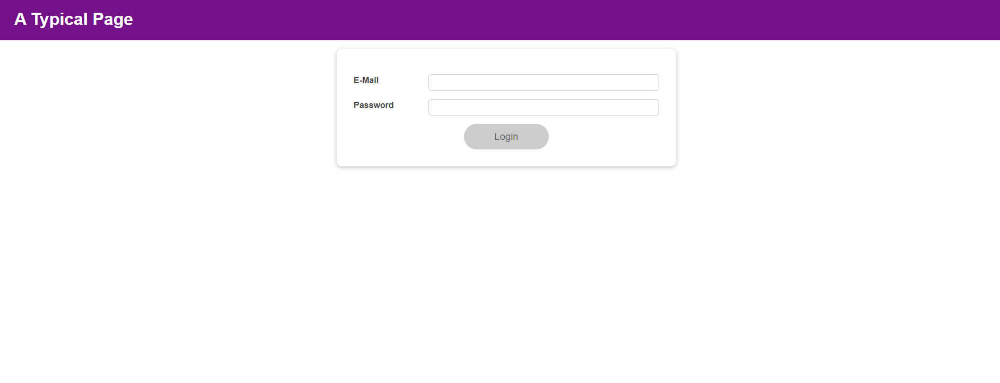
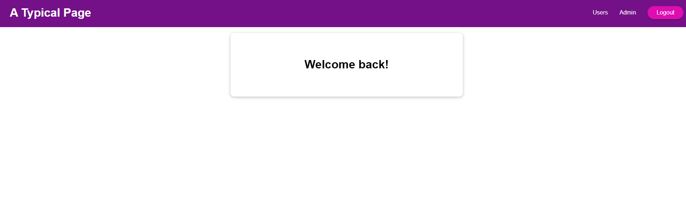

# About
React - The Complete Guide 2023 (incl. React Router & Redux)
Section 11: Advanced: Handling Side Effects, Using Reducers & Using the Context API
# Features
- useState
- useEffect
- useReducer
- local storage

